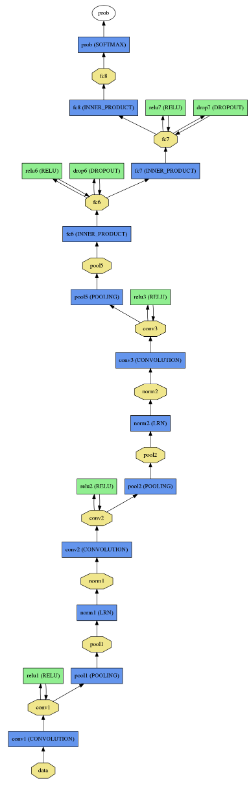
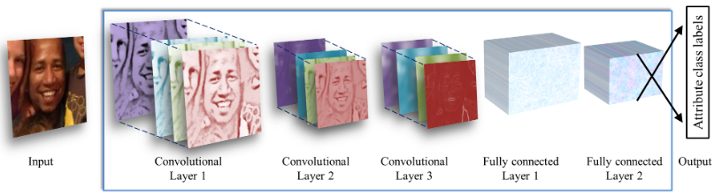

# AgeGenderPrediction

These models are based on this [paper](https://talhassner.github.io/home/projects/cnn_agegender/CVPR2015_CNN_AgeGenderEstimation.pdf)

## Network Architecture


The network contains three convolutional layers, each followed by a rectified linear operation and pooling layer. The first two layers also follow normalization using local response normalization. The first Convolutional Layer contains 96 filters of 7×7 pixels, the second Convolutional Layer contains 256 filters of 5×5 pixels, The third and final Convolutional Layer contains 384 filters of 3×3 pixels. Finally, two fully-connected layers are added, each containing 512 neurons.



## Dataset Preparation
### Download
The dataset used for training is UTKFace but filter to get only Asian people for the project's purpose. Full UTKFace dataset can be download at [UTKFace](https://susanqq.github.io/UTKFace/)

To download UTKFace AsianOnly:
```bash
./download.sh
```
### Split train/test and oversampling train set
```python
python3 build_dataset.py
```
_Note:_ the split ratio is 0.8. After spliting into train/test set, the augmentation process is then implemented by flipping and adding noise to original images to balance number of sample between age classes.
```python3
Number of image per age class:
0-9	10-19	20-29	30-39	40-49	50-59	60-69	70-79	80-120
--------------------------------------------------------------
734	78	1066	423	126	95	76	67	82
Number of image per gender class:
Male	Female
--------------
1260	1487

AFTER OVERSAMPLING:
Number of image per age class:
0-9	10-19	20-29	30-39	40-49	50-59	60-69	70-79	80-120
--------------------------------------------------------------
1066	1066	1066	1065	1066	1065	1066	1065	1066
Number of image per gender class:
Male	Female
--------------
5690	3901
```
### Create lmdb - Make mean file
```bash
./create_lmdb.sh
./create_mean.sh
```
## Train and Test
### Train
_Train AgeNet_
```python3
./train_AgeNet.sh
```
_Train GenderNet_
```python3
./train_GenderNet.sh
```
### Test
_Test AgeNet_
```python3
./test_AgeNet.sh
```
_Test GenderNet_
```python3
./test_GenderNet.sh
```
### Test result
_AgeNet_
```python
Accuracy: 66.5%, 457/687 corrects

Confusion matrix:
Actual\Predict	0-9	10-19	20-29	30-39	40-49	50-59	60-69	70-79	80-120	
		-----------------------------------------------
0-9		178	2	7	2	0	0	0	0	2
10-19		4	2	9	3	1	0	0	0	0
20-29		1	2	214	44	2	2	2	2	0
30-39		2	2	50	37	8	5	1	2	1
40-49		0	1	6	10	8	2	1	0	0
50-59		0	0	1	4	3	3	5	1	0
60-69		2	0	3	2	0	3	3	3	0
70-79		0	0	1	0	0	4	8	4	3
80-120		1	0	0	2	0	0	2	6	8
```
_GenderNet_
```python
Accuracy: 85.2%, 585/687 corrects

Confusion matrix:
Actual\Predict	Male	Female	
		-----------------------------------------------
Male		267	53
Female		49	318
```

## Convert to NCS graph
This script compiles AgeNet and GenderNet caffe models into NCS graphs. It also converts mean file.
```bash
./compile2Movidius.sh
```

## Run inference
```python3
python3 run_inference.py --mean_file age_gender_mean.npy --image_path image/test_0.png
```
## Citation
```
@inproceedings{LH:CVPRw15:age,
 author    = {Gil Levi and Tal Hassner},
 title     = {Age and Gender Classification Using Convolutional Neural Networks},
 booktitle = {IEEE Conf. on Computer Vision and Pattern Recognition (CVPR) workshops},
 month	=  {June},
 year 	= {2015},
 URL 	= {\url{https://osnathassner.github.io/talhassner/projects/cnn_agegender}}
}
```
